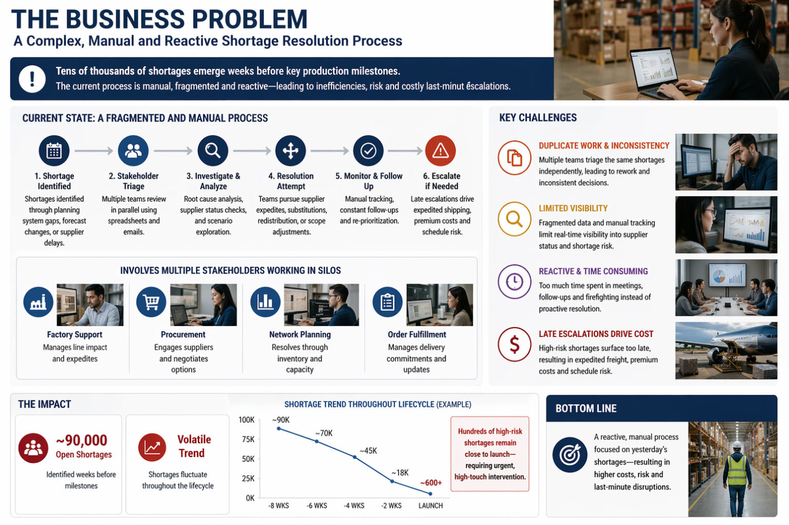
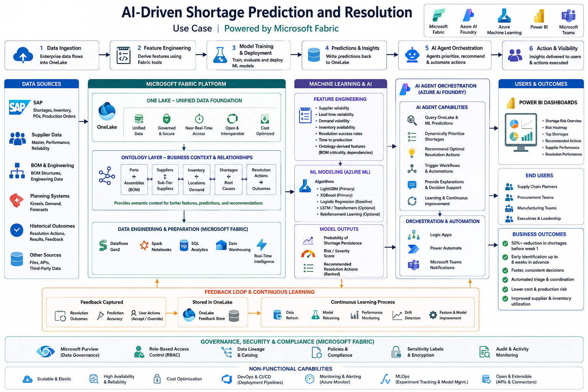

# Fabric IQ — Parts Shortages Intelligence

An AI-powered shortage intelligence solution built on Microsoft Fabric, Fabric IQ Ontology, and Azure AI Foundry agents. It predicts, prioritizes, and recommends actions for parts shortages across a complex multi-plant supply chain.

---

## Table of Contents

1. [Business Problem](#1-business-problem)
2. [Solution Architecture](#2-solution-architecture)
3. [Fabric IQ Ontology](#3-fabric-iq-ontology)
4. [Cost / Benefit Analysis](#4-cost--benefit-analysis)
5. [User Interface](#5-user-interface)
   - [5.1 Business Operations](#51-business-operations)
   - [5.2 Admin / IT Operations](#52-admin--it-operations)
   - [5.3 System Design & Documentation](#53-system-design--documentation)
6. [Source Code Repository](#6-source-code-repository)

---

## 1. Business Problem

Capital‑equipment manufacturers face a recurring "shortage wave" in the 8 weeks leading up to each tool launch. A typical cycle starts with **~90,000 open shortages** at week 8 and must be driven down to a handful of urgent past‑due items by week 1. Today this is done with daily HTL stand‑ups, manual MAST triage, parallel reviews across Factory Support, Network Planning, SBM, and Order Fulfillment, and a heavy reliance on expedite freight and consignment draw‑downs. The process is labor‑intensive, duplicative across functions, and reactive — shortages reappear late in the cycle from supplier pull‑backs and demand swings.

🎥 **Walkthrough video:** [Business Problem Overview](https://1drv.ms/v/c/4673b287399127d4/IQCfxQCkWM6sRIao0V0GmvgcAZo30myNJH4qXYodI0OjS9U?e=YVzQHC)

---

## 2. Solution Architecture

The solution is built on **Microsoft Fabric** (OneLake, Lakehouses, Notebooks, Data Agents) for unified data and ML, **Fabric IQ Ontology** for a semantic graph of supply‑chain entities, and **Azure AI Foundry agents** for orchestration and conversational experiences. ML models for shortage risk, demand forecasting, and action recommendation are trained in Fabric and surfaced through a web UI and a suite of AI assistants.

🎥 **Walkthrough video:** [Architecture Overview](https://1drv.ms/v/c/4673b287399127d4/IQA4wuZ1X8G4T5TVD6xOMXh3AXnXwaDwD0zKlSOM6zXS3lY?e=uIOJry)

---

## 3. Fabric IQ Ontology

The **Fabric IQ Ontology** provides a semantic layer over OneLake tables, modeling supply‑chain concepts such as *Material*, *Plant*, *Shortage Event*, *Machine Configuration*, and the relationships between them. This lets both humans and AI agents reason over the data using business concepts instead of raw tables, and enables the Fabric Data Agent to answer natural‑language questions grounded in governed data.

| Ontology — Entities | Ontology — Material/Plant | Ontology — Shortage Event |
|---|---|---|
|  |  |  |

🎥 **Walkthrough video:** [Fabric IQ Ontology Overview](https://1drv.ms/v/c/4673b287399127d4/IQDdRsI2DMAAR7c93slkDaq3ATl-gir-r_6HTpdtNzdMHtY?e=u1tZsM)

---

## 4. Cost / Benefit Analysis

The MVP targets a **50% reduction in shortages at week 1**, yielding an estimated **~$20.3M / year** in savings across three independent levers. Sensitivity across a 10%–75% reduction range produces **$4.0M – $30.4M / year**.

| Lever | Annual savings at 50% goal |
|---|---:|
| Labor automation (HTL meetings, triage, parallel reviews) | **$11.6M** |
| Expedite & consignment premium avoided | **$7.1M** |
| Revenue timing (fewer launch slips) | **$1.6M** |
| **Total** | **$20.3M / yr** |

Baseline workload: **~540,000 shortage events / yr** across **6 launch cycles**, **~175,500 labor hours / yr** at a $110/hr fully‑loaded rate.

📄 Full model, assumptions, formulas, and sensitivity table: [docs/BUSINESS_VALUE.md](docs/BUSINESS_VALUE.md)

---

## 5. User Interface

The application is organized into three functional zones:

### 5.1 Business Operations

Tools used by supply‑chain planners, SBMs, and operations leaders to monitor, predict, and act on shortages.

**Dashboards and Reports** — executive dashboards, at‑risk parts, severity breakdowns, supplier health, predictions feed, and the feedback‑learning loop:

| | |
|---|---|
|  |  |
|  |  |
|  |  |
|  |  |
|  |  |
|  |  |
|  |  |

**AI Assistants** — conversational agents (Operations Data Assistant, Recommendation Copilot, Operations Orchestration Assistant) plus an Agent Prompt Lab:

| | |
|---|---|
|  |  |
|  |  |
|  |  |
|  | |

### 5.2 Admin / IT Operations

Tools used by IT and ML engineers to manage data ingestion, feature engineering, model training, and model performance monitoring.

| | |
|---|---|
|  |  |
|  |  |
|  |  |
|  |  |
|  | |

### 5.3 System Design & Documentation

In‑app architecture, dataflow, ML algorithm, table catalog, and ontology‑explorer views for solution discoverability.

| | |
|---|---|
|  |  |
|  |  |
|  |  |
|  |  |
|  |  |
|  | |

Single sign‑on / OTP login is supported:

---

## 6. Source Code Repository

The source code lives in a **private** GitHub repository:

🔒 **[github.com/csdmichael/Fabric-IQ-Ontology-Parts-Shortages](https://github.com/csdmichael/Fabric-IQ-Ontology-Parts-Shortages)**

For access, please contact the repository owner ([@csdmichael](https://github.com/csdmichael)) with your GitHub username and a brief description of your use case.
