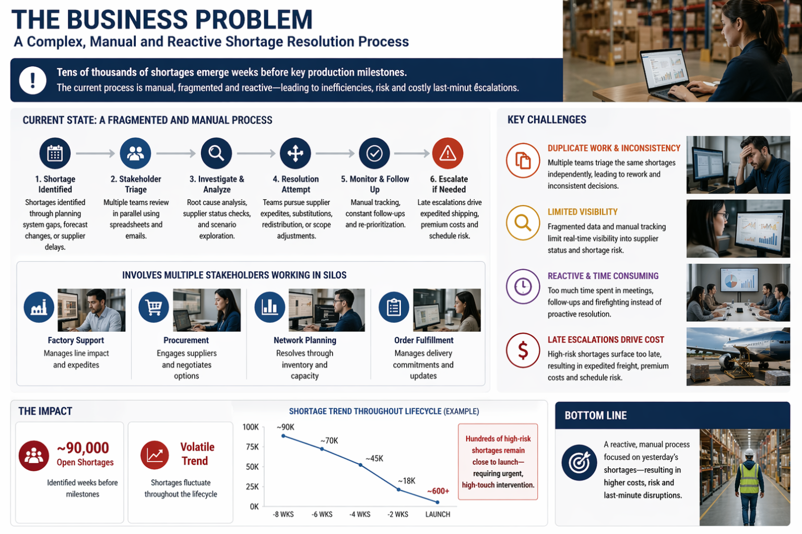
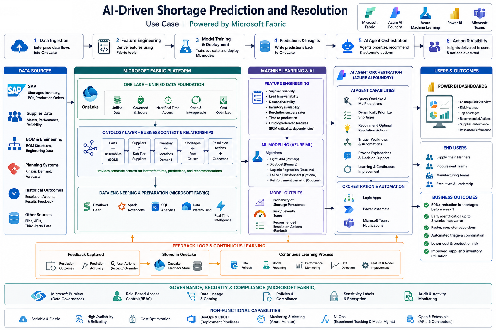
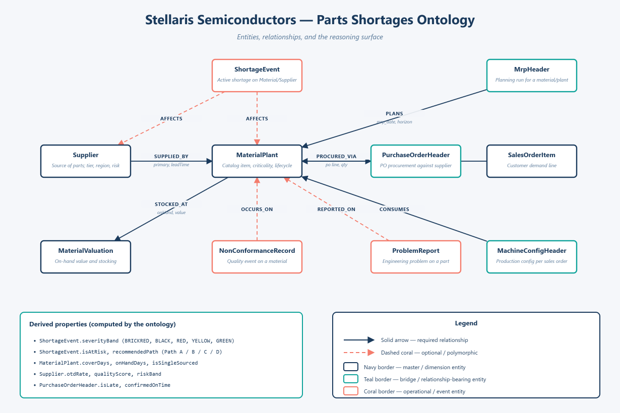

# Fabric IQ — Parts Shortages Intelligence

An AI-powered shortage intelligence solution built on Microsoft Fabric, Fabric IQ Ontology, and Azure AI Foundry agents. It predicts, prioritizes, and recommends actions for parts shortages across a complex multi-plant supply chain.

📄 **Full solution overview deck:** [Fabric-IQ-Ontology-Part-Shortages-AI-Intelligence.pdf](docs/Fabric-IQ-Ontology-Part-Shortages-AI-Intelligence.pdf)

---

## Table of Contents

1. [Business Problem](#1-business-problem)
2. [Solution Architecture](#2-solution-architecture)
3. [Fabric IQ Ontology](#3-fabric-iq-ontology)
   - [3.1 Fabric Ontology Agent — Documentation](#31-fabric-ontology-agent--documentation)
   - [3.2 Creating the Ontology with the Ontology Agent](#32-creating-the-ontology-with-the-ontology-agent)
4. [ML Algorithms](#4-ml-algorithms)
5. [Cost / Benefit Analysis](#5-cost--benefit-analysis)
6. [User Interface](#6-user-interface)
   - [6.1 Business Operations](#61-business-operations)
   - [6.2 Admin / IT Operations](#62-admin--it-operations)
   - [6.3 System Design & Documentation](#63-system-design--documentation)
   - [6.4 Operations Agent & Automation Actions](#64-operations-agent--automation-actions)
7. [Deployment Guide](#7-deployment-guide)
8. [Source Code Repository](#8-source-code-repository)
9. [Future Ideas — Extending the POC](#9-future-ideas--extending-the-poc)

---

## 1. Business Problem

Capital‑equipment manufacturers face a recurring "shortage wave" in the 8 weeks leading up to each tool launch. A typical cycle starts with **~90,000 open shortages** at week 8 and must be driven down to a handful of urgent past‑due items by week 1. Today this is done with daily HTL stand‑ups, manual MAST triage, parallel reviews across Factory Support, Network Planning, SBM, and Order Fulfillment, and a heavy reliance on expedite freight and consignment draw‑downs. The process is labor‑intensive, duplicative across functions, and reactive — shortages reappear late in the cycle from supplier pull‑backs and demand swings.

🎥 **Walkthrough video:** [Business Problem Overview](https://1drv.ms/v/c/4673b287399127d4/IQCfxQCkWM6sRIao0V0GmvgcAZo30myNJH4qXYodI0OjS9U?e=YVzQHC)

---

## 2. Solution Architecture

The solution is built on **Microsoft Fabric** (OneLake, Lakehouses, Notebooks, Data Agents) for unified data and ML, **Fabric IQ Ontology** for a semantic graph of supply‑chain entities, and **Azure AI Foundry agents** for orchestration and conversational experiences. ML models for shortage risk, demand forecasting, and action recommendation are trained in Fabric and surfaced through a web UI and a suite of AI assistants.

🎥 **Walkthrough video:** [Architecture Overview](https://1drv.ms/v/c/4673b287399127d4/IQA4wuZ1X8G4T5TVD6xOMXh3AXnXwaDwD0zKlSOM6zXS3lY?e=uIOJry)

---

## 3. Fabric IQ Ontology

The **Fabric IQ Ontology** provides a semantic layer over OneLake tables, modeling supply‑chain concepts such as *Material*, *Plant*, *Shortage Event*, *Machine Configuration*, and the relationships between them. This lets both humans and AI agents reason over the data using business concepts instead of raw tables, and enables the Fabric Data Agent to answer natural‑language questions grounded in governed data.

**Ontology Overview** — End‑to‑end map of the Parts Shortages ontology: entities (master, bridge, and operational/event), their relationships, and the derived properties computed by the ontology that power downstream reasoning (severity bands, risk flags, cover‑days, supplier scores, PO lateness).

**Machine Configuration Header** — The top‑level *MachineConfigHeader* entity that represents a tool/system configuration. It is the anchor object linking bills of materials, plants, and downstream shortage events back to a specific machine build.

**Material / Plant relationship** — The *Material* and *Plant* entities and their many‑to‑many association. This view shows how a given part number is sourced, stocked, and consumed across multiple manufacturing plants, which is the basis for cross‑plant reallocation recommendations.

**Shortage Event entity** — The *ShortageEvent* entity with its attributes (severity, past‑due flag, root‑cause code, recommended action) and its relationships to Material, Plant, Supplier, and Machine Configuration. This is the core fact the AI agents and dashboards reason over.

🎥 **Walkthrough video:** [Fabric IQ Ontology Overview](https://1drv.ms/v/c/4673b287399127d4/IQDdRsI2DMAAR7c93slkDaq3ATl-gir-r_6HTpdtNzdMHtY?e=u1tZsM)

### 3.1 Fabric Ontology Agent — Documentation

The ontology used by this solution is built and operated with the **Microsoft Fabric Ontology Agent (preview)** — an AI-powered Copilot that creates, improves, and queries ontologies over Fabric workspace data through a natural-language chat interface. A local, offline copy of the customer documentation (styled like Microsoft Learn) is included under [docs/ontology-agent-docs/](docs/ontology-agent-docs/index.html).

**What the agent does** — Grounds an ontology in your workspace data by defining *entity types*, *relationships*, *data bindings*, and *contextualizations*, then lets you query it in plain language (auto-selecting **KQL** for Eventhouse tables, **SQL** for Lakehouse tables, and **GQL** for graph traversals). It runs a guided **Discover → Draft → Validate → Apply** flow, previews every change in the ontology canvas, and uses your own identity (delegated access) so it can only read/write what your Entra ID + Fabric RBAC already allow. A **Plan mode** (safe, read-only, default) vs **Act mode** (applies changes) toggle keeps you in control.

**Documentation pages** (local copies):

| Page | Summary |
|---|---|
| 📖 [Overview](docs/ontology-agent-docs/fabric-ontology-agent-overview.html) | What an ontology is, how to create one with the agent, the Plan/Act modes, the draft-preview canvas, supported data sources (Lakehouse, Eventhouse, semantic model, GraphModel), regions, and current preview limitations. |
| ✅ [Best practices](docs/ontology-agent-docs/fabric-ontology-agent-best-practices.html) | A 4-phase guide to prepare for accurate results: organize your workspace, prepare data sources, follow ontology design conventions, and work effectively with the agent. |
| 🛡️ [Responsible AI FAQ](docs/ontology-agent-docs/fabric-ontology-agent-responsible-use.html) | Reliability of results, how the agent uses and collects data, fairness considerations, handling unexpected content, and recommended human-in-the-loop workflow integration. |
| 🔐 [Governance & privacy FAQ](docs/ontology-agent-docs/fabric-ontology-agent-governance-faq.html) | Data & privacy, compliance and data residency (incl. EU Data Boundary), model and data usage (no foundation-model training on your data), reliability/safety, and access control. |
| 🧰 [Troubleshooting](docs/ontology-agent-docs/fabric-ontology-agent-troubleshooting.html) | Fixes for common authorization/access, ontology creation, existing-ontology, Plan/Act mode, and AI/model issues, plus where to get more help. |
| 💲 [Billing & cost management](docs/ontology-agent-docs/fabric-ontology-agent-billing.html) | Consumption-based billing backed by Fabric capacity, what incurs cost (create / improve / query operations), what's free during preview, and tips to manage spend. |

**Useful links:**

- 🗂️ [Ontology agent docs — local index](docs/ontology-agent-docs/index.html)
- 🔗 [What is ontology (preview)? — Microsoft Learn](https://learn.microsoft.com/fabric/iq/ontology/overview)
- 🔗 [Copilot in Microsoft Fabric — overview](https://learn.microsoft.com/fabric/get-started/copilot-fabric-overview)
- 🔗 [Microsoft Fabric pricing](https://azure.microsoft.com/pricing/details/microsoft-fabric/)
- 🔗 [Supplemental Terms of Use for Microsoft Azure Previews](https://azure.microsoft.com/support/legal/preview-supplemental-terms/)

> **Preview note:** The Fabric Ontology Agent is currently in preview; billing terms and pricing for general availability aren't finalized.

### 3.2 Creating the Ontology with the Ontology Agent

The Parts Shortages ontology (`on_part_shortages`) was authored end-to-end with the Ontology Agent. The screenshots below walk through the exact create flow — from an empty ontology item to a published, grounded ontology.

**Step 1 — Start with the Ontology agent** — Open a new (empty) Fabric ontology item. The Explorer shows *No entity types available*, and the canvas presents a **Get started** page. Select **Start with Ontology agent** to let the AI Copilot guide you through building the ontology (the alternative *Learn more* card just opens the docs).

**Step 2 — Reopen the agent on an existing ontology** — Once a definition exists, you can bring the agent back any time from the **Ontology agent** button on the toolbar to explain, query, or improve the ontology. Here the Explorer already lists the published entity types (`ClearingEvent`, `MachineBuild`, `MaterialDemandPlan`, `Part`, `PartShortage`, `Supplier360`, …).

**Step 3 — Answer the agent's domain-scoping questions** — The agent opens in the chat panel and asks clarifying questions to scope the work (what event/condition to detect, the scope of parts vs assemblies vs suppliers, the authoritative source, and any files or business rules to include). One-click suggestion chips — *Build ontology from my data*, *Ask me questions first*, *Explain what an ontology is* — help you get going. The **Plan / Act** toggle stays on **Plan** (read-only) during this phase.

**Step 4 — Chat to shape and draft the ontology** — Continue the conversation to refine grain, naming, and scope (for example, *include only business-facing entities, keep source-aligned names, optimize for both shortage investigation and operational planning*). The agent works through **Evaluating relationships → Drafting ontology definitions**, grounded in the discovered evidence.

**Step 5 — Review the draft summary and preview it** — The agent summarizes the proposed draft (in-scope entities and relationships, each with concrete source bindings, key fields, and semantic enrichment) with collapsible sections for *Key modeling choices*, *Validation results*, *Notable coverage*, *Remaining assumptions*, and *Next step*. Select **Preview ontology** to open a read-only view in the canvas.

**Step 6 — Review the proposed ontology in the canvas** — The canvas shows the full proposed structure as an *AI Proposal* — entity types in the Explorer and the relationship graph (e.g. `PartShortage` linked to `Part`, `Supplier360`, `MachineBuild`, `ClearingEvent`, and `ClearingPathOption`). A banner notes it's a read-only proposal. When you're satisfied, switch to **Act** mode and select **Act and approve**.

**Step 7 — Generate (apply) the ontology** — After approval in Act mode, the agent applies the definition — *Reviewing data sources → Reviewing business context → Generating Ontology* — and publishes it to the ontology item. From here the ontology is live and ready for querying and downstream use.

---

## 4. ML Algorithms

Three purpose-built ML problems — all trained and scored on **Microsoft Fabric Spark** with **SynapseML LightGBM** — power the predictive and prescriptive layer of the solution. Every model uses a single distributed `pyspark.ml.Pipeline` (Imputer median + StringIndexer `handleInvalid="keep"` + VectorAssembler + LightGBM estimator), CrossValidator-tuned over a `ParamGridBuilder`, MLflow Spark-tracked, and engineered to scale to the full **30M+ shortage event** feature frame — the same Pipeline object trains and scores, so there is no train/serve skew.

- **Problem 1 — Demand forecast (`demand_forecast`)** — *Recommended: SynapseML `LightGBMRegressor` (Spark), CrossValidator-tuned.* Predicts the next-period plant-level shortage rate (target = `demand_qty / shortage_rate`) from rolling demand, on-hand cover, lead-time variance, and lagged shortage signals so SPMs get a forward signal before material shortages hit production. Headline metrics: RMSE / MAE / R². Output table: `ml.pred_demand_forecast`.
- **Problem 2 — Risk classification (`risk_classifier`)** — *Recommended: SynapseML `LightGBMClassifier` (Spark), `objective="binary"`, `isUnbalance=true`, CrossValidator-tuned.* Scores every open shortage with a calibrated `P(at-risk)` probability and a 4-band class (`LOW` / `MEDIUM` / `HIGH` / `CRITICAL`) that drives the cockpit, Top At-Risk Parts view, and severity roll-ups. Native `isUnbalance` handling removes the need for row-level resampling at 30M+ row scale. Output table: `ml.pred_shortage_risk`.
- **Problem 3 — Prescriptive recommendation (`action_recommender`)** — *Recommended: SynapseML `LightGBMClassifier` (Spark, multiclass) over 4 mitigation paths.* Recommends one of **Path A (Expedite Alternate Source)**, **Path B (Pull Regional Buffer Stock)**, **Path C (Re-sequence Production)**, or **Path D (Monitor Only)** with per-class confidence and a USD impact estimate, driving the AI Action Queue. SPM approvals / rejections from the cockpit flow back through `/agents/feedback` into the next redesign as a continuous-retraining signal. Output table: `ml.pred_action_recommendation`.

The pipeline runs as a **6-notebook pattern** under `fabric/notebooks/`: notebooks `01-03_ml_design_*` retrain when drift breaches a threshold and stage a new `model_version_id` with `status='active'` in the Lakehouse Delta `ml.ml_model_registry` table; notebooks `04-06_ml_prediction_*` resolve the active version, load the MLflow Spark `PipelineModel` from OneLake `Files/ml_artifacts/{version_id}/{task}_lightgbm/`, score via Spark, and overwrite the `ml.pred_*` tables. Notebook 06 runs last because it rebuilds `ml.pred_shortage_insights` by joining the other two prediction tables. A full design run on a small Fabric Spark pool completes a 3-task CV sweep on 30M rows in ~15–25 minutes; the prediction notebooks complete in minutes. Eleven `ml.*` Delta tables (4 prediction + 7 ML diagnostics — registry, training metrics, feature importance, coefficient matrix, selected features, performance, efficiency) plus the `mlcfg.*` customer-editable config schema underpin the Admin / IT Operations and ML Performance dashboards.

🎥 **Walkthrough video:** [ML Algorithms Overview](https://1drv.ms/v/c/4673b287399127d4/IQAqnV510hZFSIfadk20E9nUAcarb-BvMMudFbONGwM5_FM?e=DdzESB)

---

## 5. Cost / Benefit Analysis

The MVP targets a **50% reduction in shortages at week 1**, yielding an estimated **~$20.3M / year** in savings across three independent levers. Sensitivity across a 10%–75% reduction range produces **$4.0M – $30.4M / year**.

| Lever | Annual savings at 50% goal |
|---|---:|
| Labor automation (HTL meetings, triage, parallel reviews) | **$11.6M** |
| Expedite & consignment premium avoided | **$7.1M** |
| Revenue timing (fewer launch slips) | **$1.6M** |
| **Total** | **$20.3M / yr** |

Baseline workload: **~540,000 shortage events / yr** across **6 launch cycles**, **~175,500 labor hours / yr** at a $110/hr fully‑loaded rate.

📄 Full model, assumptions, formulas, and sensitivity table: [docs/BUSINESS_VALUE.md](docs/BUSINESS_VALUE.md)

---

## 6. User Interface

**UI URL:** https://fabriciq-shortages-ui-b3.azurewebsites.net

The application is organized into three functional zones:

### 6.1 Business Operations

Tools used by supply‑chain planners, SBMs, and operations leaders to monitor, predict, and act on shortages.

#### Dashboards and Reports

🎥 **Walkthrough video:** [Business Operations — Reports](https://1drv.ms/v/c/4673b287399127d4/IQC9c-Sd95JwQ5aGxGO59RNuAXNRLlVvdjEi8k2PGcSv5GY?e=5C9hds)

**Navigation menu** — Entry point for all operations dashboards, reports, and drill‑through views.

**Part Shortages — Executive Dashboard** — Cycle‑level KPIs (open shortages, past‑due count, week‑over‑week trend) tailored for supply‑chain leadership.

**Top At‑Risk Parts** — Ranked list of parts most likely to slip, scored by the Shortage Risk Calculator ML model and enriched with supplier and plant context.

**Shortages by Severity** — Visual breakdown of open shortages by severity tier (critical / high / medium / low) for triage prioritization.

**Shortages by Severity — Detail list** — Row‑level drill‑down behind the severity tile, showing each shortage with material, plant, due date, and recommended action.

**Shortage Resolution — Paths** — Sankey/funnel view of how shortages move through the resolution paths (expedite, reallocate, substitute, re‑plan) with throughput at each step.

**Shortages by Plant** — Heat‑map / bar view of open shortages distributed across manufacturing plants to spot regional hotspots.

**Supplier Health — On‑Time Delivery** — Supplier scorecard ranking vendors by OTD%, lead‑time variance, and shortage contribution.

**Supplier Health — Detail** — Drill‑through into an individual supplier with PO history, defect rate, and the shortages they are currently driving.

**Operational Report** — Tabular operational report consumed in HTL stand‑ups, exportable for offline review.

**Executive Dashboard (rollup)** — Cross‑program executive rollup combining shortage trend, savings realized, and AI‑agent activity in a single board view.

**Predictions and Recommendations** — ML‑generated forecasts paired with the Action Recommender's top suggested resolution per shortage.

**Predictions Feed** — Streaming feed of newly generated predictions as fresh data lands in OneLake, with confidence scores.

**Feedback / Learning Cycle** — Closed‑loop view where planner accept/reject decisions on recommendations are captured and fed back into model retraining.

#### AI Assistants

🎥 **Walkthrough video:** [Business Operations — AI Assistants](https://1drv.ms/v/c/4673b287399127d4/IQBvYxrYreY8QrXqWod_Il1TARzApnoJakz_fat9K4zvSm4?e=O1d4Gj)

**Operations Data Assistant — Try** — Natural‑language Q&A over the OneLake ontology (powered by Fabric Data Agent). Planners can ask things like "show me all critical shortages at Plant 4 due this week."

**Operations Data Assistant — Trace** — Inspector view showing the agent's reasoning trace: tool calls, generated SQL/KQL, retrieved rows, and the final grounded answer.

**Operations Data Assistant — Feedback** — Thumbs‑up/down plus comment capture on each answer, feeding the continuous‑evaluation pipeline.

**Recommendation Copilot Assistant** — Conversational front‑end to the Action Recommender model — explains *why* a given action is recommended and lets the user accept, modify, or reject.

**Operations Orchestration Assistant** — The Foundry orchestrator agent that routes user intents across the Data Agent, Recommendation Copilot, and downstream workflow tools.

**Agent Prompt Lab — Samples** — Library of curated prompt samples for each assistant, used for onboarding and regression testing.

**Agent Prompt Lab — Try in Chat** — Interactive sandbox to run sample prompts in chat against any selected agent and inspect the response.

**Chat Assistant — Floating Shortage Assistant** — A persistent floating chat panel (the *Shortage Assistant*, backed by the Foundry `chat-assistant` agent) that follows the planner across every page of the app. Users can launch it from anywhere — including directly from a *Try in Chat* card in the Agent Prompt Lab — pick an agent from the *AGENT* selector, and ask grounded natural‑language questions about open shortages. Responses are rendered as a markdown table with a citation back to the lakehouse source, an **auto‑generated chart** (donut / bar) inferred from the response shape, and inline copy / 👍 / 👎 controls that feed the continuous‑evaluation pipeline — so planners can ask, visualize, and rate answers without ever leaving the page they were working on.

### 6.2 Admin / IT Operations

Tools used by IT and ML engineers to manage data ingestion, feature engineering, model training, and model performance monitoring.

🎥 **Walkthrough video:** [Admin / IT Operations Overview](https://1drv.ms/v/c/4673b287399127d4/IQBZ6S17GP8HQ5vW3PWkLwFXAQuwbKL1GoCAPt6NtoCIk3g?e=iDK3NZ)

**Admin menu** — Entry point for the data, feature, training, and model‑monitoring tools.

**Data Ingestion** — Status board for ingestion pipelines bringing source data (ECC shortages, MRP, supplier feeds) into OneLake Lakehouses.

**Feature Engineering — Catalog** — Browse the full feature catalog (lead‑time variance, supplier OTD, demand volatility, etc.) generated from the ontology.

**Feature Engineering — Selected Features** — Per‑model selected feature set with importance scores, used as inputs for the training pipeline.

**Model Training** — Training run dashboard: kick off retraining, monitor progress, and compare hyperparameter sweeps.

**ML Model Performance — Action Recommender** — Accuracy, precision/recall, and acceptance‑rate metrics for the Action Recommender model.

**ML Model Performance — Demand Forecaster** — Forecast error (MAPE, RMSE), bias trend, and back‑testing for the Demand Forecaster.

**ML Model Performance — Shortage Risk Calculator** — ROC/AUC, calibration, and confusion matrix for the Shortage Risk Calculator classifier.

**Predictions and Insights** — Operational view of the latest model outputs being written back to OneLake for downstream dashboards and agents.

### 6.3 System Design & Documentation

In‑app architecture, dataflow, ML algorithm, table catalog, and ontology‑explorer views for solution discoverability.

🎥 **Walkthrough video:** [System Design & Documentation Overview](https://1drv.ms/v/c/4673b287399127d4/IQD11R0OHtP0Rqt378p3wPFzATjISyvAAFFNcJzePjdhjhw?e=K6G1qC)

**Documentation menu** — Entry point for the in‑app system design and documentation views.

**Architecture** — End‑to‑end architecture diagram rendered inside the app: source systems → Fabric ingestion → Lakehouse → Ontology → ML → Foundry agents → UI.

**Solution Dataflow** — Logical dataflow showing how a raw shortage record propagates through bronze/silver/gold layers and into predictions and recommendations.

**ML Algorithms** — Reference card for each model (Shortage Risk Calculator, Demand Forecaster, Action Recommender): algorithm family, inputs, outputs, and refresh cadence.

**App URLs** — Catalog of all deployed endpoints (web app, Foundry agents, Fabric workspaces) for quick navigation.

**OneLake Tables** — Catalog of the source/curated tables in OneLake with descriptions and row counts.

**ML Output Tables** — Catalog of model‑output tables (predictions, recommendations, scores) written back to OneLake for downstream consumption.

**Drill‑through — Shortages table** — Browse the raw `ecc.zspm_shortages` rows directly from the documentation view for validation and lineage checks.

**Fabric Ontology Explorer** — Interactive ontology browser embedded in the app, showing the full set of entities defined in Fabric IQ.

**Ontology Explorer — Relationships** — Graph view of relationships (Material→Plant, Plant→Shortage, Supplier→Material, etc.) used by the Data Agent for grounded retrieval.

**Ontology Explorer — Entities & Attributes** — Per‑entity attribute schema with data types and semantic descriptions; this is what makes natural‑language Q&A reliable.

**Login — SSO / OTP** — The app supports Entra ID single sign‑on with a one‑time‑passcode fallback for external/guest users.

### 6.4 Operations Agent & Automation Actions

The **Fabric IQ Operations Agent** (`opsAgent_part_shortages`, a Microsoft Fabric Real-Time Intelligence agent) is the always-on counterpart to the on-demand Foundry agents in section 6.1. It runs on a **5-minute autonomous cadence**, evaluates 12 operational rules (R1–R12) against the live ML prediction tables (`ml.pred_shortage_risk`, `ml.pred_action_recommendation`, `ml.pred_demand_forecast`, `ml.pred_shortage_insights`) plus the operational ontology (`ShortageEvent`, `Supplier`, `MaterialPlant`, `PurchaseOrder`, `DemandForecast`), and routes the resulting actions to the right business team through **Microsoft Teams Adaptive Cards (v1.5)**, **email**, and **HTTP API triggers** — without taking any planner out of their flow.

🎥 **Walkthrough video:** [Fabric Data Agent and Operations Agent](https://1drv.ms/v/c/4673b287399127d4/IQBXC3jSVzxYT4mpnFYTWHDMART05_6OONsDzGR_1Og0giw?e=hPYqv5)

**Operations Agent — agent setup in Fabric portal**

The agent is bound to the `on_part_shortages` ontology as its knowledge source, runs to the operational instructions shown in the portal, and exposes its custom actions in the *Actions* panel — each action lights up as **Action connected** once its Power Automate flow is published.

#### Daily Brief — Operations Manager

The **Daily Brief – Operations Manager** action is the flagship custom action. Once per day, the Operations Agent assembles a grounded executive brief from the lakehouse and delivers it as a fully formatted HTML email through Power Automate + **Azure Communication Services (ACS)**. The same brief is also surfaced as a Daily Brief page inside the web UI, with a *Send Email* modal so any operator can dispatch it on demand.

**Email — High-level summary, KPI tiles, severity mix, plant load, and Top 10 parts at risk**

**Email — Shortages by severity + Recommended action playbook (paths A–D, SLA windows, owners)**

The brief is intentionally grounded — every value comes from the parts-shortages warehouse via the Fabric Data Agent — and the recommended-action playbook maps each severity band (BRICKRED, BLACK, RED, YELLOW, GREEN) to one of the four mitigation paths the `action_recommender` ML model emits, with the owning role (SBM, SCSP, MFG, PMO) and SLA window pre-filled.

#### Power Automate custom actions — Teams, Email, and API triggers

All custom actions are implemented as **Power Automate flows** triggered by the *"When a Fabric Operations Agent action is invoked"* connector. The trigger output carries the structured payload from the lakehouse (shortage_id, recommended_path, risk_band, expected_impact_usd, owner_role, plant, supplier_code, rationale, …), and each flow fans the payload out across one or more of three integration surfaces:

- **Microsoft Teams** — *Post adaptive card* (Adaptive Cards v1.5) into the *Parts Shortages War Room* team / *launch-blockers* channel, with severity color, owner @-mention, SLA countdown, and one-click **Approve / Decline / Snooze / Open in Cockpit** buttons. Approval clicks come back to the same flow and are POSTed to `/agents/feedback`, so every human-in-the-loop decision feeds the next ML retraining cycle.
- **Email** — outbound email via **Azure Communication Services (ACS)** for the daily / weekly digests and proactive SLA-breach alerts (sender controlled by `AUTH_ACS_SENDER_ADDRESS`).
- **HTTP / API triggers** — built-in *HTTP* action calls into downstream business systems (MAST, Kinaxis, SAP, supplier portals, ServiceNow, ticketing) and into the Fabric IQ API (`/agents/feedback`, `/shortages/feedback`) to update systems of record and route notifications to the right business team.

| # | Custom action | Trigger condition (rule) | Primary delivery | Owner role |
|---|---|---|---|---|
| 1  | **Daily Brief — Operations Manager** | Scheduled daily | Email (ACS) + Teams | Operations Manager |
| 2  | **PostDailyDigest** | End-of-shift roll-up | Teams adaptive card | Shift Lead |
| 3  | **PostCriticalWarRoomAlert** | New BRICKRED / BLACK shortage (R1) | Teams adaptive card + Email | SBM + Procurement |
| 4  | **ApproveClearingPath** | New ranked recommendation from `action_recommender` | Teams adaptive card with Approve / Decline buttons → `/agents/feedback` | SBM / SCSP / MFG / PMO |
| 5  | **EscalateToProcurement** | Critical shortage with no SBM action in window | Teams + Email + ServiceNow API | Procurement Lead |
| 6  | **FlagDemandSpike** | `demand_forecast` flags spike beyond on-hand + open-PO cover | Teams + planning-system API | SCSP |
| 7  | **SlaBreachProactiveAlert** | Approaching path SLA breach (≤ 4h / 12h / 48h / 120h) | Teams + Email | Owner role per path |
| 8  | **SupplierScorecardDigest** | Weekly supplier OTD / lead-time roll-up | Email (ACS) + Teams | SBM |
| 9  | **WeeklyExecRetrospective** | Weekly cycle close | Email (ACS) | Executive |
| 10 | **HandoffToNextShift** | Shift change | Teams adaptive card | Shift Lead |
| 11 | **ResolveShortageWithFeedback** | Planner closes a shortage in Teams | HTTP → `/agents/feedback` | All planners |

A portable **Power Automate kit** is checked into the source repo (one `.kit.md` per action) so any customer tenant can stand up the same automation surface: each kit lists the trigger outputs, the verbatim Adaptive Card JSON, the HTTP step contract, and the smoke-test steps. Combined with the 12 operational rules and the lakehouse-grounded knowledge source, this turns the predictive ML stack into a closed-loop operations system — agent detects → routes to the right business team → human decides → feedback retrains the model.

---

## 7. Deployment Guide

Fabric IQ deploys into a customer tenant via a short, table‑driven runbook: three manual Azure resources (Resource Group, Fabric capacity, Foundry account) plus a one‑time Entra app‑registration handoff, followed by five idempotent PowerShell scripts that provision, wire, and verify everything else from a single `azure.config.json` source of truth. End‑to‑end setup typically runs ~30 minutes when Subscription Owner, Entra admin, and Fabric admin roles are held by the same person.

📄 Full prerequisites, role matrix, manual steps, automated pipeline, and troubleshooting: [docs/DEPLOYMENT_GUIDE.md](docs/DEPLOYMENT_GUIDE.md)

---

## 8. Source Code Repository

The source code lives in a **private** GitHub repository:

🔒 **[github.com/csdmichael/Fabric-IQ-Ontology-Parts-Shortages](https://github.com/csdmichael/Fabric-IQ-Ontology-Parts-Shortages)**

For access, please contact the repository owner ([@csdmichael](https://github.com/csdmichael)) with your GitHub username and a brief description of your use case.

---

## 9. Future Ideas — Extending the POC

The current solution is a working end‑to‑end POC. The following enhancements would harden it for broad enterprise rollout across security, governance, cost control, data protection, identity, and operations.

### 9.1 Security — Microsoft Defender for Cloud & Defender for AI

- Onboard the Fabric capacity, Foundry account, Storage, Key Vault, and App Service to **Microsoft Defender for Cloud** for continuous posture management (CSPM) and workload protection (CWPP).
- Enable **Defender for AI Workloads** on the Foundry account to detect prompt‑injection, data‑exfiltration, jailbreak, and wallet‑abuse patterns against the Operations, Recommendation, and Orchestration agents.
- Stream Defender alerts into a central Log Analytics workspace and surface them on the Admin / IT Operations dashboard alongside ML model health.
- Apply **Azure Policy** initiatives (Microsoft Cloud Security Benchmark, NIST 800‑53) at the Resource Group scope so every future deployment inherits the same guardrails.

### 9.2 AI Gateway — Azure API Management in Front of Foundry Agents

Put **Azure API Management (APIM) as an AI Gateway** between the web app and the Foundry agents / model endpoints to centralize governance:

- **Token limits & quotas** per user, per agent, and per cost center using the `llm-token-limit` / `azure-openai-token-limit` policies.
- **Cost tracking & chargeback** via `llm-emit-token-metric` / `azure-openai-emit-token-metric`, with prompt and completion tokens dimensioned by subscription, user, and cost center, then visualized in Azure Monitor workbooks.
- **Semantic caching** (`llm-semantic-cache-*`) to deflect repeat planner questions (e.g. *"show critical shortages at Plant 4"*) and cut Foundry inference cost.
- **Centralized governance** — single ingress for authN/Z, throttling, content safety, jailbreak detection, audit logging, and circuit‑breaking across all current and future agents.
- **Load balancing & failover** across multiple Foundry deployments / regions for resilience during launch‑week traffic spikes.

### 9.3 Data Protection — Microsoft Purview Sensitivity Labels & Row‑Level Security

- Apply **Microsoft Purview** sensitivity labels (e.g., *Confidential — Supply Chain*, *Restricted — Supplier Pricing*) to OneLake tables, Fabric items, and Foundry datasets so classification flows end‑to‑end.
- Enable **Row‑Level Security (RLS)** and **Object‑Level Security (OLS)** on the gold Lakehouse / semantic model so a planner only sees shortages for their plant(s) or program(s), and supplier‑sensitive columns (cost, contract terms) are masked for non‑sourcing roles.
- Wire the Fabric Data Agent to respect the caller's Entra identity so natural‑language Q&A inherits the same RLS rules — no bypass via the agent.
- Use **Purview DLP** policies to prevent labeled data from being copied into unmanaged exports or pasted into external LLMs.

### 9.4 Identity — Extend Entra ID Integration with App Manifest Metadata

Entra ID SSO is already implemented. Extend it with **App Registration manifest** metadata to drive enterprise lifecycle and chargeback:

- Populate **Application** and **Service Principal** custom security attributes (`costCenter`, `businessUnit`, `dataOwner`, `environment`, `program`) so every API/agent call can be attributed to a cost center.
- Use **optional claims** and **app roles** (`Planner`, `Sourcing`, `Admin`, `Executive`) to drive UI authorization and RLS scoping consistently from a single source of truth.
- Tag Azure resources (Foundry, APIM, App Service, Storage, Fabric capacity) with the same `costCenter` / `program` values so Azure Cost Management reports line up with Entra app metadata.
- Enforce **Conditional Access** (compliant device, MFA, named locations) on the app and on the Foundry / APIM endpoints.

### 9.5 Operations — Azure SRE Agent for 24×7 Monitoring

- Onboard the App Service, APIM, Foundry account, and Fabric workloads to the **Azure SRE Agent** for autonomous incident detection, triage, and remediation suggestions.
- Let the SRE Agent watch Application Insights / Log Analytics signals (latency, 5xx, token‑spend anomalies, ML drift alerts, Defender alerts) and open enriched incidents with probable root cause and suggested runbooks.
- Integrate SRE Agent findings into the Admin / IT Operations console alongside model‑performance dashboards so platform health and ML health are observed in one pane.
- Pair with **Azure Monitor Workbooks** and **Action Groups** for paging, and feed post‑incident learnings back into the deployment runbook in [docs/DEPLOYMENT_GUIDE.md](docs/DEPLOYMENT_GUIDE.md).

### 9.6 MLOps — Azure Machine Learning for Model Lifecycle & Versioning

Today the Shortage Risk Calculator and Demand Forecaster are trained and scored inside Fabric notebooks. Promoting them to **Azure Machine Learning (Azure ML)** would add the MLOps rigor needed for an enterprise rollout:

- **Model registry & versioning** — register every trained model in the **Azure ML Model Registry** with immutable versions, lineage back to the training run, dataset snapshot, and git commit; promote across `dev` → `staging` → `production` stages with approval gates.
- **Experiment tracking** — use **MLflow** (native in Azure ML) to log parameters, metrics, artifacts, and confusion matrices for every training run so model improvements are auditable and reproducible.
- **Automated training pipelines** — define **Azure ML Pipelines** (or **Prompt Flow** for LLM components) triggered by new OneLake data, code changes, or drift signals from the Admin console, replacing ad‑hoc notebook reruns.
- **Managed online & batch endpoints** — deploy registered models as **Azure ML managed endpoints** with blue/green and canary rollout, autoscale, and built‑in authentication, then call them from the Fabric pipelines and the agents instead of in‑notebook scoring.
- **Responsible AI & model monitoring** — enable the **Responsible AI dashboard** (fairness, explainability, error analysis) at registration time and **Azure ML data‑drift / model‑monitoring** jobs in production, feeding drift and quality alerts into the Admin / IT Operations dashboard next to Defender and SRE Agent signals.
- **CI/CD with GitHub Actions / Azure DevOps** — wire the registry, pipelines, and endpoints into a GitOps workflow so model promotion follows the same review, test, and rollback discipline as application code.

### 9.7 Other Candidate Extensions

- **Continuous evaluation** of all Foundry agents (groundedness, relevance, safety) on a scheduled batch, with results trended in the Admin console.
- **Multi‑tenant / multi‑program** isolation using Fabric workspace‑per‑program plus APIM products keyed by `program` claim.
- **Event‑driven retraining** triggered by drift detected in the Shortage Risk Calculator or Demand Forecaster.
- **Microsoft 365 Copilot / Copilot Studio** extension that wraps the Foundry orchestrator agent as a declarative-agent package, so planners can chat with the same grounded agent surfaces from M365 Copilot in addition to the Operations Agent's Teams Adaptive Cards already shipping in [section 6.4](#64-operations-agent--automation-actions).
