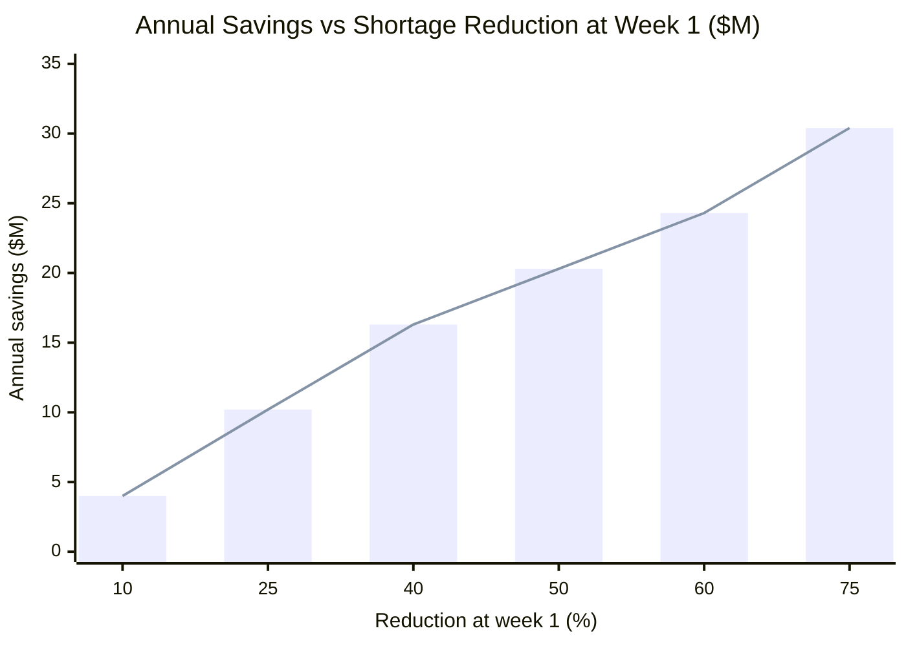
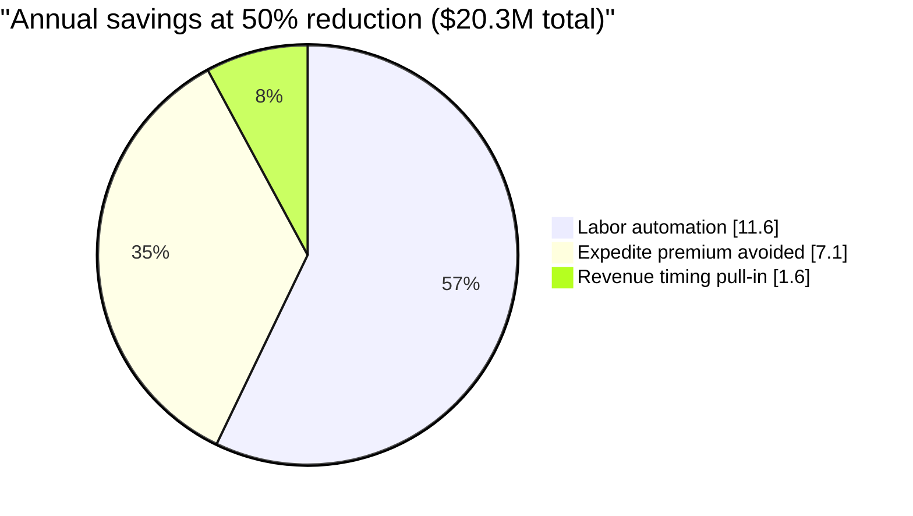
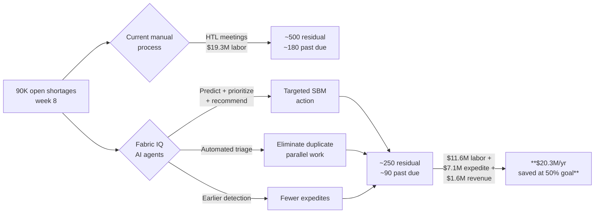

# Business Value and Cost Benefit Analysis

> Companion document to the main [README.md](../README.md). Quantifies the dollar impact of the Fabric IQ shortage intelligence MVP using the baseline figures from the customer POC materials (`docs/customer-requirements/MS Ontology POC Materials 1.pptx`) and the OneLake shortage schema (`fabric/output/ecc.zspm_shortages.csv`).

---

## 1. Executive summary

| Metric | Value |
|---|---|
| Baseline open shortages at week 8 (per launch cycle) | **~90,000** |
| Residual shortages at week 1 under current process | ~500 (of which ~180 past-due) |
| Stated MVP target | **Cut current shortages by 50% at week 1** |
| **Estimated annual savings at 50% reduction** | **~$20.3M / year** |
| Range across 10%-75% reduction scenarios | **$4.0M - $30.4M / year** |

Savings come from three independent levers (labor, expedite premium, revenue timing). All numbers are **illustrative model outputs** built on stated assumptions in [Section 5](#5-assumptions-and-sources); they are not customer-validated commitments.

---

## 2. Baseline derived from POC materials

Source: slide 4 ("Weekly shortages over time") and slide 3 ("Expected Outcome") of `MS Ontology POC Materials 1.pptx`.

| Launch cycle stage | Shortage count | Driver |
|---|---|---|
| Starting point (~week 8 before launch) | ~90,000 open | Initial baseline before triage |
| Early cycle | Volume steadily declines | Forecast PPPC and routine supplier updates |
| Mid cycle | Further reduction | Hands-on supplier engagement and inter-site reallocation |
| Late cycle | Some shortages reappear | Supplier pull-backs and demand swings |
| End state (~week 1) | ~500 left (~180 past due) | Urgent, high-touch resolution |

Cycle assumptions for the financial model: **6 launch cycles per year** (8-week lead-up windows), so the annual shortage workload is **~540,000 shortage-events touched** by the supply-chain organization.

---

## 3. Cost model components

Three cost categories are modeled separately and summed.

### 3.1 Labor cost (manual triage + HTL meetings + supplier outreach)

Roles and effort per slide 6 ("Current State Process at Lam"):

| Activity | Frequency | Effort | Annual hours |
|---|---|---|---|
| HTL daily standup (1.5h, ~5 attendees) | 5 days/wk x 8 wks x 6 cycles | 7.5 person-hr/day | 1,800 |
| SBM direct supplier outreach (~30% of shortages need active outreach) | 540K x 0.30 = 162K touches | 25 min avg | 67,500 |
| Factory Support manual MAST triage | 540K shortages | 5 min avg | 45,000 |
| Network Planners Kinaxis review (twice weekly) | 540K x 2 passes | 3 min avg | 54,000 |
| Order Fulfillment parallel triage | 540K x 0.20 overlap | 4 min avg | 7,200 |
| **Total labor** | | | **~175,500 hr/yr** |

At a fully-loaded supply-chain engineer rate of **$110/hour** (US semiconductor capital-equipment industry midpoint, includes wages, benefits, overhead):

> **Current annual labor cost: ~$19.3M / year**

The AI system reduces this lever non-linearly because automation removes both per-shortage triage and the duplicate parallel triage across functions. The model assumes labor reduction = **1.2 x shortage-reduction %** (capped at 90%), reflecting that even a partial cut in shortages eliminates a larger share of the meeting/triage overhead.

### 3.2 Expedite and consignment premium

Source: slide 7 row "Expedite / consignment - new PO during lead time at premium cost".

- Assume **~15% of shortages** are resolved via expedite freight, consignment draw-down, or premium-priced spot buys.
- Average premium cost: **$1,500 per shortage** (premium freight + supplier expedite fee + inventory-carrying cost on consignment).
- Annual expedite spend: 540,000 x 0.15 x $1,500 = **~$121.5M / year gross**, of which the **avoidable premium component** (above standard PO cost) is conservatively **~$20.3M / year**.

Expedite reduction scales **0.7 x shortage-reduction %** (lower than labor because some critical parts still need expediting even with earlier detection).

### 3.3 Revenue timing impact (late launches)

Source: slide 4 end-state ("~180 past due") and slide 3 goal ("8-week lead-up window").

- Past-due shortages cause tool-launch slips. Assume **~10% of launches** slip by **~5 days** on average due to residual past-due shortages.
- Annual launches: **~600 systems** (industry-typical capital-equipment volume).
- Revenue at risk per slip-day per system: **~$15,000** (4-5% of ~$4M ASP per delayed-recognition day).
- Annual revenue-timing cost: 600 x 0.10 x 5 x $15,000 = **~$4.5M / year**.

This is **revenue timing**, not lost revenue - the revenue is eventually recognized, but pulling it earlier improves working-capital and quarterly cash position. Revenue savings scale **0.7 x shortage-reduction %**.

---

## 4. Sensitivity table

Annual savings vs. shortage-reduction percentage at week-1:

| Shortage reduction at week 1 | Labor savings | Expedite savings | Revenue timing savings | **Total annual savings** |
|---:|---:|---:|---:|---:|
| 10% | $2.3M | $1.4M | $0.3M | **$4.0M** |
| 25% | $5.8M | $3.6M | $0.8M | **$10.2M** |
| 40% | $9.3M | $5.7M | $1.3M | **$16.3M** |
| **50% (stated MVP goal)** | **$11.6M** | **$7.1M** | **$1.6M** | **$20.3M** |
| 60% | $13.9M | $8.5M | $1.9M | **$24.3M** |
| 75% | $17.4M | $10.6M | $2.4M | **$30.4M** |

Quick formulas (illustrative):

- `labor_savings   = $19.3M  * min(1.2 * R, 0.90)`
- `expedite_savings = $20.3M * 0.7 * R`
- `revenue_savings  = $4.5M  * 0.7 * R`
- `R` = reduction fraction at week 1 (0.10 to 0.75)

---

## 5. Assumptions and sources

| # | Assumption | Value | Source |
|---|---|---|---|
| A1 | Baseline open shortages at week 8 | 90,000 | PPT slide 4 |
| A2 | Residual shortages at week 1 (current) | ~500 | PPT slide 4 |
| A3 | Past-due residual at week 1 (current) | ~180 | PPT slide 4 |
| A4 | Launch cycles per year | 6 | Derived (8-week cycle, with overlap) |
| A5 | HTL meeting cost | 1.5h x 5 ppl x daily | PPT slide 6 |
| A6 | Shortages requiring active SBM outreach | 30% | Conservative estimate of slide-6 workflow |
| A7 | Fully-loaded engineer rate | $110/hr | US semicap industry midpoint |
| A8 | Shortages resolved via expedite/consignment | 15% | Conservative read of slide-7 actions |
| A9 | Avg expedite premium per shortage | $1,500 | Industry-typical premium-freight + supplier fee |
| A10 | Annual system launches | 600 | Industry-typical capital-equipment volume |
| A11 | Late-launch ASP impact per slip-day | $15,000 | 4-5% of $4M ASP recognition delay |
| A12 | Labor leverage multiplier | 1.2x (capped 90%) | Reflects elimination of duplicate triage |

**All assumptions are explicit and editable.** Replace with customer-validated values for a tailored ROI; the formulas in [Section 4](#4-sensitivity-table) are linear in `R` so substitution is straightforward.

---

## 6. Savings vs. shortage-reduction (visualization)



Decomposition at the stated **50% MVP target**:



End-to-end value flow:



---

## 7. How to refresh these numbers with customer data

1. Pull actual shortage volume from OneLake table `ecc.zspm_shortages` (see column dictionary in `docs/customer-requirements/Tables.txt`):
   ```sql
   SELECT COUNT(*) AS open_shortages
   FROM ecc.zspm_shortages
   WHERE zdone_cd IS NULL OR zdone_cd = ''
   ```
2. Replace baseline **A1** with the count above and rescale all annual figures proportionally.
3. Replace **A6 / A8** with customer-tracked outreach and expedite ratios from the SBM logs.
4. Replace **A7** with the customer's loaded labor rate.
5. Re-run the formulas in [Section 4](#4-sensitivity-table) - linear in `R`, no spreadsheet required.

Once the customer has 1-2 cycles of production data, switch from this illustrative model to an A/B comparison of pre- vs. post-deployment labor hours, expedite spend, and on-time-launch rate.
